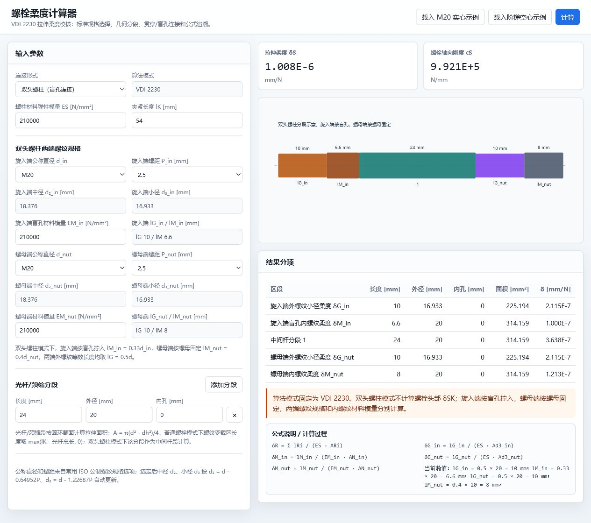

# 螺栓柔度计算器

v0.5 - 示例与公式追溯增强版

这是一个基于 VDI 2230 拉伸柔度公式整理的静态网页版计算器，当前定位为“VDI 2230 拉伸柔度校核工具”。

在线访问：<https://hou-yexing.github.io/blot_stiff/>



## 使用方式

直接打开 `index.html` 即可本地使用，无需安装依赖或启动服务器。公网版本由 GitHub Pages 发布。

## 当前功能

- 标准公制螺栓公称直径和螺距选择
- 自动计算中径 `d2` 和小径 `d3`
- 贯穿连接 / 盲孔连接 / 双头螺柱（盲孔连接）切换
- 双头螺柱两端螺纹规格、螺距和内螺纹材料模量可独立设置
- 双头螺柱两端空余螺纹长度参与柔度计算，并校核夹紧长度组成
- 提供 M20 双头螺柱、异径双头螺柱示例，以及螺母端空余螺纹自动配平
- 按已核对的 VDI 2230 截图公式计算拉伸柔度分项
- 输出拉伸柔度 `deltaS` 和螺栓轴向刚度 `cS`
- 显示连接尺寸参考图、计算分段示意图、分项公式和完整 `deltaS` 求和式
- 对关键输入进行错误/警告提示，错误状态下结果不可用

## 计算边界

当前版本只展示拉伸柔度与轴向刚度。已实现公式包括：

- `deltaSK = lSK / (ES * AN)`
- `deltaR = sum(lRi / (ES * ARi))`
- `deltaGew = lGew / (ES * Ad3)`
- `deltaG = lG / (ES * Ad3)`
- `deltaM = lM / (EM * AN)`
- `deltaGM = deltaG + deltaM`
- 双头螺柱模式：`deltaG_in + deltaM_in + deltaFree_in + deltaR + deltaFree_nut + deltaG_nut + deltaM_nut`

其中 `hh`、`dh` 属于几何示意参数，不参与当前 `deltaSK` 拉伸柔度公式。双头螺柱模式下不计算螺栓头部 `deltaSK`；旋入端按盲孔拧入 `lM_in = 0.33d_in`，螺母端按螺母固定 `lM_nut = 0.4d_nut`，两端外螺纹等效长度均取 `lG = 0.5d`。双头螺柱夹紧长度必须满足 `l_free_in + sum(lRi) + l_free_nut = lK`，两端空余螺纹按对应端小径面积计入受拉柔度；“自动调整螺母端空余螺纹”会按 `l_free_nut = lK - l_free_in - sum(lRi)` 计算，若结果为负则不写入并冻结结果。

## 更新和发布

GitHub Pages 发布源为 `main` 分支根目录。修改网页后执行：

```powershell
git status
git add index.html README.md assets/screenshot.png
git commit -m "Update calculator"
git push origin main
```

推送成功后，GitHub Pages 会自动更新：<https://hou-yexing.github.io/blot_stiff/>

如果推送时出现 GitHub 认证失败或凭据超时，可先重新登录：

```powershell
git credential-manager github login
git push origin main
```

## 文件

- `index.html`: 网页计算器
- `assets/bolt-connection-diagram.png`: 螺栓连接尺寸示意图
- `assets/screenshot.png`: 当前页面截图
- `螺栓柔度理论计算.pdf`: 原始参考资料
